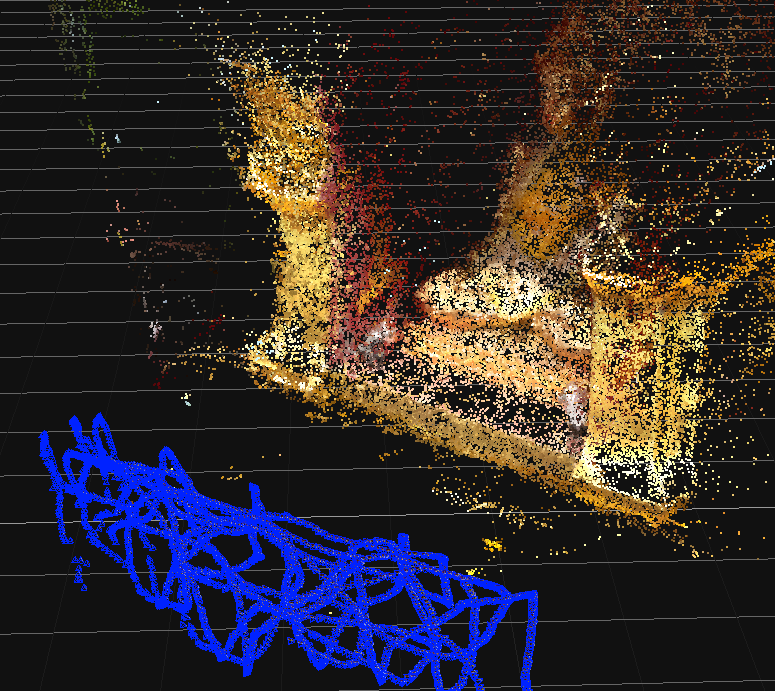
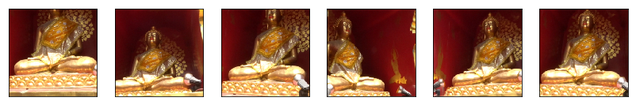
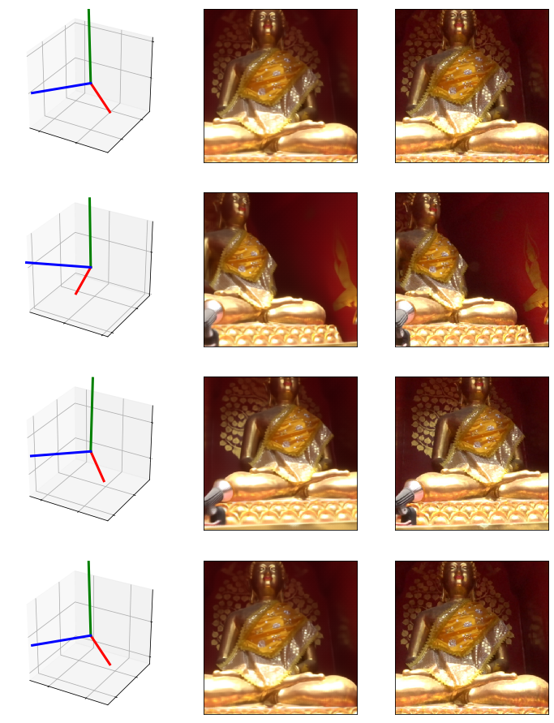

# Reverse-Matchmove-GAN
The goal of this project is to be able to reverse enginear new camera views from existing footage. This is the same network from my blog post: http://neuralvfx.com/matchmove/reverse-matchmove-gan/

My dataset was created by photographing many random angles of a statue in Chiang Mai. I'll be posting this dataset online soon!

# Code Usage

*This repo is still being buit and tested, I will update the Usage when complete*

# Example Data Set
## Chiang Mai
### Camera Matrices

### Images

# Example Results
#### (1: Camera Matrix — 2: Generated Image — 3: Grount Truth Image)

# Video Examples

