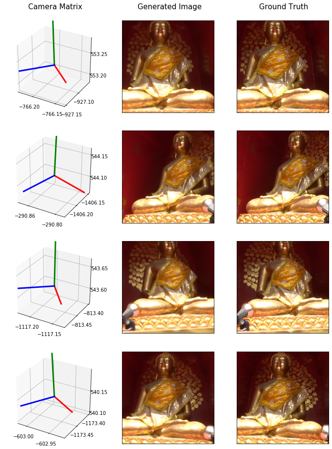

# Reverse-Matchmove-GAN

The goal of this project is to be able to reverse engineer new camera views from existing footage. This is the same network from my blog post: http://neuralvfx.com/matchmove/reverse-matchmove-gan/

My dataset was created by photographing many random angles of a statue in Chiang Mai. Using a photo-modeling tool I've extracted camera positions and created a CSV file of Matrix-Image pairs. 

The Chiang Mai dataset can be downloaded here: http://neuralvfx.com/datasets/reverse_matchmove/chiang_mai_hi.rar

# Generated Video Example

# Code Usage
Usage instructions found here: [user manual page](USAGE.md).

# Example Data Set

# Example Augmentation

# Example Results

