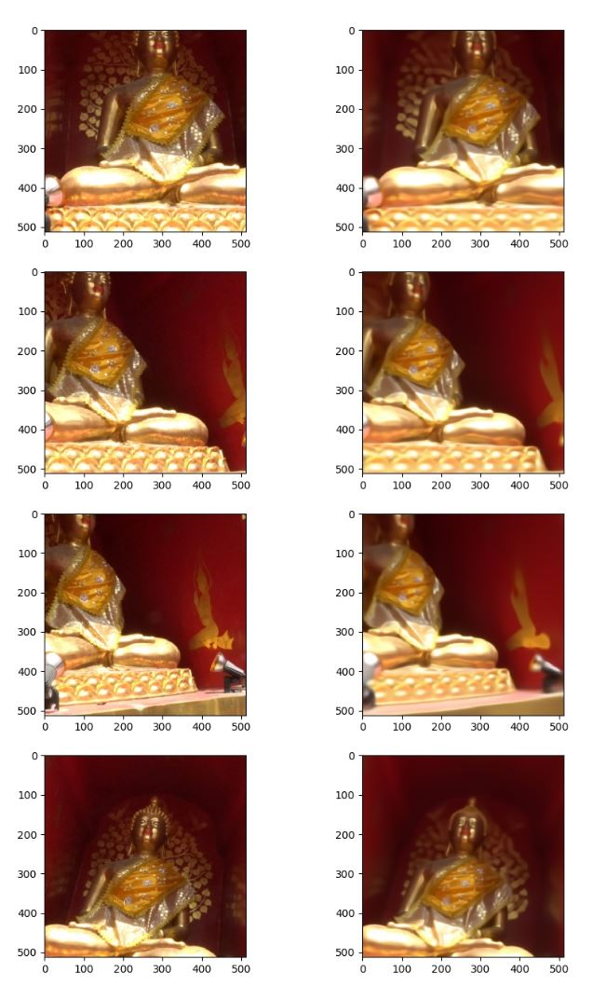
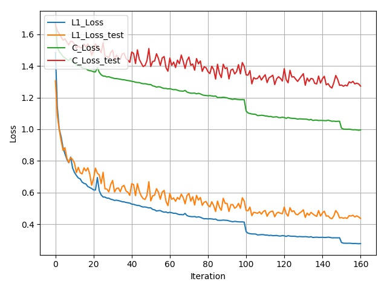

## Getting Started
- Check your python version, this is built on `python 3.6`
- Install `pytorch 0.4.0` and dependencies from https://pytorch.org/
- Install packages `tqdm`, `cv2`, `matplotlib`, `torchvision`, `pandas`
- Install `ImageMagick` and `rar`

- Clone this repo:
```bash
git clone https://github.com/NeuralVFX/reverse-matchmove-gan.git
cd reverse-matchmove-gan
```
- Download the dataset (e.g. [Chiang Mai](http://neuralvfx.com/datasets/reverse_matchmove/chiang_mai_hi.rar)):
```bash
bash data/get_test_dataset.sh
```

## Train The Model
```bash
python train.py --dataset chiang_mai_hi --train_epoch 500 --save_root chiang_mai
```

## Continue Training Existing Saved State
```bash
python train.py --dataset chiang_mai_hi --train_epoch 500 --save_root chiang_mai --load_state output/chiang_mai_3.json
```

## Command Line Arguments
```
--dataset, default='chiang_mai_hi', type=str                   # Dataset folder name
--batch_size, default=4, type=int                              # Training batch size
--workers, default=8, type=int                                 # How many threads to help with dataloading
--res, default=512, type=int                                   # Image resolution, for dataloading, and generator (must be a power of 2: 128, 256, 512, 1024)
--vgg_layers_p, default=[0,2,4,6,8], type=int                  # Layers of VGG to use for perceptual loss
--vgg_layers_weight, default=[1,1,1,1,1], type=float           # Weight multiplier for each VGG layer 
--l1_weight, default=3., type=float                            # Multiplier for L1 loss
--perceptual_weight, default=1.25, type=float                  # Multiplier for perceptual loss
--disc_perceptual_weight, default=1.25, type=float             # Multiplier for discriminator perceptual loss
--dp_mult, default=25, type=float                              # Amplifier for discriminator perceptual loss
--disc_loss_weight, default=.001, type=float                   # Multiplier for traditional discriminator loss
--train_epoch, default=500, type=int                           # Number of epochs to train for
--beta1, default=.5, type=float                                # Beta1 value used by optimizer
--beta2, default=.999, type=float                              # Beta2 value used by optimizer
--weight_decay, default=0, type=float                          # Weight decay for generator
--drop, default=.0, type=float                                 # Multiplier for dropout on later layers of generator
--center_drop, default=.0, type=float                          # Multiplier for dropout on first two layers of generator
--lr, default=2e-4, type=float                                 # Learning rate
--lr_drop_start, default=50, type=int                          # Epoch on which the learning rate will begin to drop
--lr_drop_every, default=50, type=int                          # How many epochs between every learning rate drop, learning rate will cut in half each time
--train_gen_every default=1, type=int                          # How many times the Discriminator should train between training the Generator
--ids_test, default=[1,100], type=int                          # Ids from test set for preview images
--ids_train, default=[0,2], type=int                           # Ids from training set for preview images
--save_every, default=5, type=int                              # How many epochs between each model save
--save_img_every, default=1, type=int                          # How many epochs between saving image
--save_root, default='chiang_mai', type=str                    # Prefix for files created by the model under the /output directory
--repo_name, default='dataset_repo.csv', type=str              # Name of repo CSV file, change to load different camera path CSV files to test     
--reset, default=False, type=bool                              # This starts history recording over from scratch, but keeps existing weights
--load_state, type=str                                         # Optional: filename of state to load and resume training from
--just_make_gif, default=False, type=bool                      # Turn this on if you simply want to load weights and make a new animated gif from the repo file    
```

## Data Folder Structure

- Dataset:

`data/<data set>/<data set type>.csv`

- Train CSV:

`data/<data set>/dataset_train.csv`

- Test CSV:

`data/<data set>/dataset_test.csv`

- Repo CSV:

`data/<data set>/dataset_repo.csv`

## Output Folder Structure

- `weights`, `test images`, `test animated gif` and `loss graph`, are all output to this directory: `output/<save_root>_*.*`

- Test Image Example (top is test set, bottom is train set): `output/chiang_mai_100.jpg`


- Loss Graph Example (output every time weights are saved): `output/chiang_mai_loss_160.jpg`


- Test Animated Gif Example (output every time weights are saved): `output/chiang_mai_anim_100.gif`


## Make Your Own Dataset

If you happen to have an image modeling program and Maya, you can use the scripts provided in `util/maya_scripts.py` to create your own dataset. Here is a break down of the functions in that file:

- `export_multi_cam_data(filename=<string>)`
  
  Export all selected cameras into a CSV (Used for test and train set)

- `new_cam_path_from_existing(frame_offset =<int>)`
  
  Create new camera path which animates through the posisitons of the selected cameras
  
- `export_anim_cam_data(filename = <string>,frame_range = <int>)`
  
  Export animation of single selected camera into a CSV (Used for Repo dataset)

